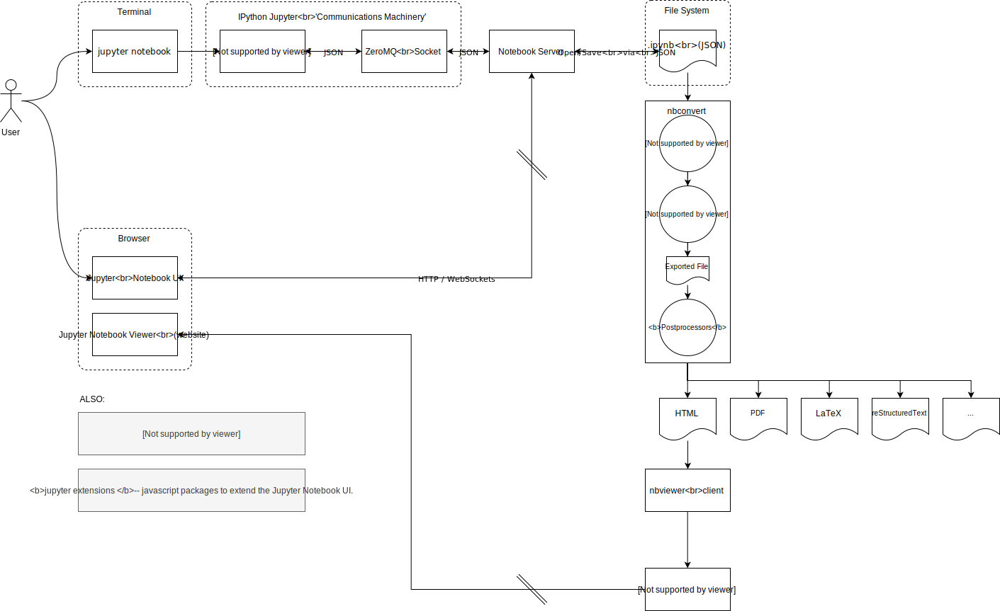

# Welcome

Right now, I'm just hosting a few notes & diagrams here.


## Jupyter Notebook Architecture
Source:
[https://jupyter.readthedocs.io/en/latest/architecture/how_jupyter_ipython_work.html](https://jupyter.readthedocs.io/en/latest/architecture/how_jupyter_ipython_work.html)


<a href="https://www.draw.io/#Hpanningforbacon%2Fpanningforbacon.github.io%2Fmaster%2Fjupyter_notebook_architecture.drawio" target="_blank">Edit</a> | <a href="https://www.draw.io/#Uhttps%3A%2F%2Fpanningforbacon.github.io%2Fjupyter_notebook_architecture.svg" target="_blank">Edit As New</a>

## Coggle.it of Data Products
[https://coggle.it/diagram/XaYGjeAbJffXLuIV/t/-](https://coggle.it/diagram/XaYGjeAbJffXLuIV/t/-)

## Javascript
### Small things
* " or ' &#129335;

### Functions have an 'arguments' object
```javascript
function sum() {
  var sum = 0;
  for(var i = 0; i < arguments.length; i++) {
    sum += arguments[i];
  }
  return sum;
}
sum(1, 2, 3, 4); // -> 10
```
### How do values/variables evaluate as boolean?
* false == false
* null == false
* undefined == false
* 0 == false
* '' == false
* person.undefinedProperty == false

### || (or) returns the first truthy or last value in the expression
This is useful in assignment statements.
```javascript
person.meetup = person.meetup || defaults.meetup || 'YYCJS';
```
### Value Equality vs Value-And-Type Equality
* == or !=: Values but not types are equal
* === or !==: Values and Types are equal
*Note: Objects are always compared by their reference.*

### Scope
* var: Scoped within function. All else is global.
* let: Scoped within block.
* cost: Scoped within bock.
*New javascript introduces new variable declaration statements for 


